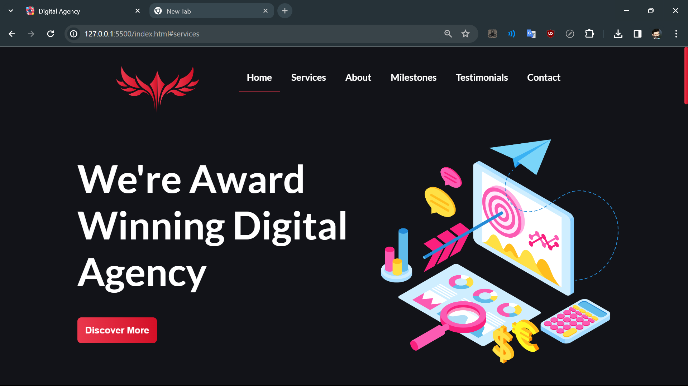
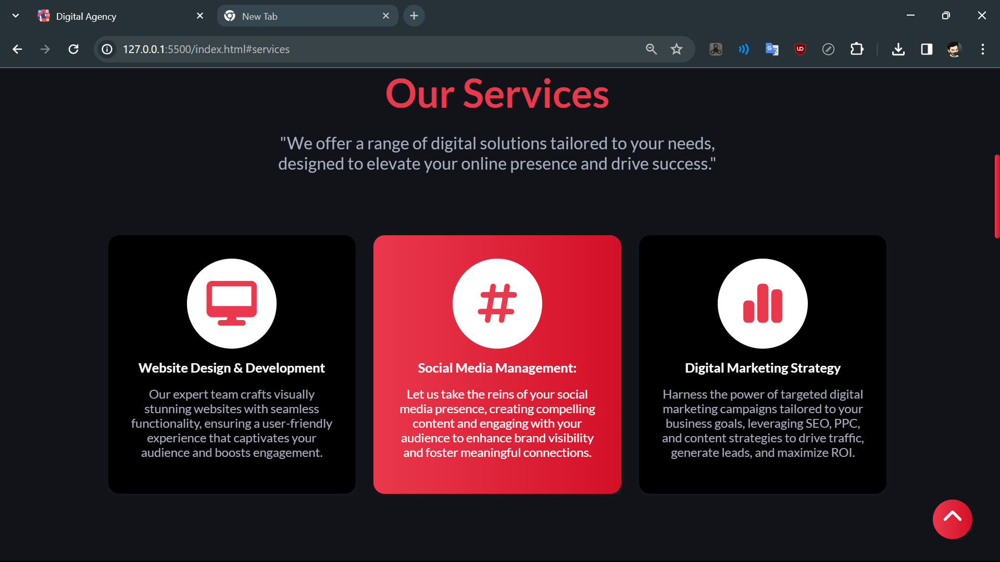
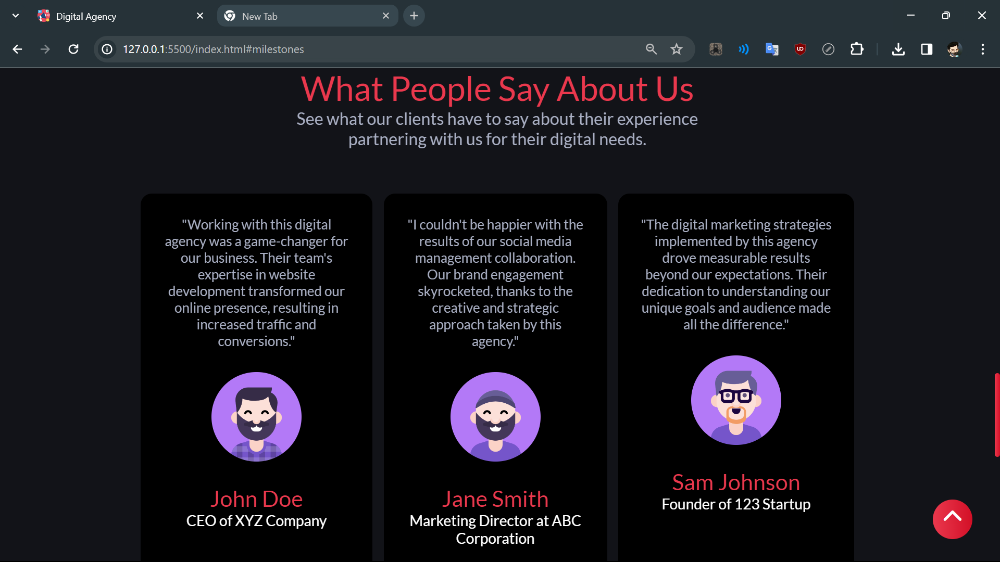
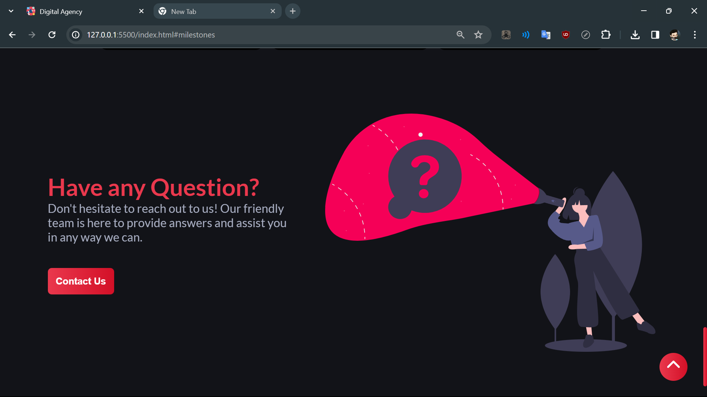

# Digital Agency Website

Welcome to the Digital Agency Website project! This is a sample website created for a fictional digital agency, showcasing services offered, testimonials, and a means for visitors to reach out with questions or inquiries.

## Features

- **Services Section:** Learn about the various digital services offered by the agency.
- **Testimonial Section:** Read testimonials from satisfied clients.
- **Have Any Questions:** A section where visitors can reach out with inquiries.

## Screenshots






## Getting Started

To get a copy of this project up and running on your local machine for development and testing purposes, follow these steps:

1. Clone the repository:

   ```bash
    git clone https://github.com/AA-18/Digital-Agency-Website.git

2. Open the project directory:
    ```bash
    cd Digital-Agency-Website

3. Open the index.html file in your web browser.

## Contributing
Contributions are welcome! If you'd like to contribute to this project, please follow these guidelines:

1. Fork the repository.
2. Create your feature branch: git checkout -b feature-name
3. Commit your changes: git commit -am 'Add some feature'
4. Push to the branch: git push origin feature-name
5. Submit a pull request.
